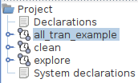
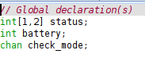
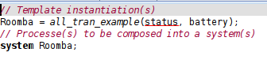
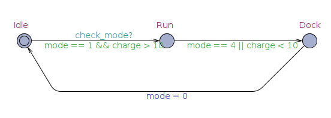
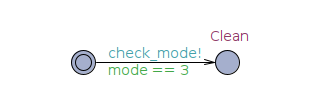
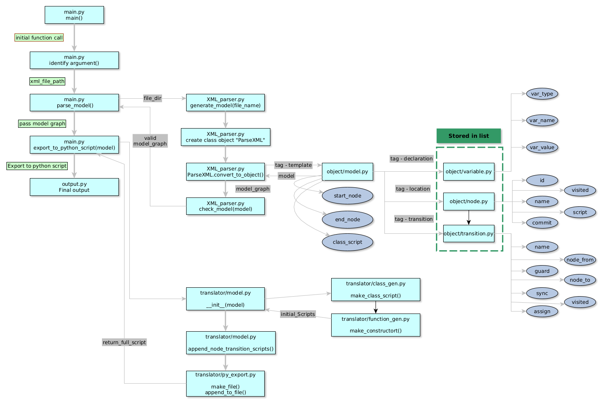

<!-- PROJECT LOGO -->
<br /></br>
<div align="center">
  
</div>
<div align="center">
  <!-- PROJECT SHIELDS -->
  <p align="center">
    </br>
    
    
    
    
    
  </p>

  <h3 align="center">MODEL TRANSLATOR</h3>
  <div align="center">
     <a href="">
      
    </a>
  </div>
  </br>
  <p align="center">
    Translate XML model into Python code
    <br />
    <a href="https://tcc2021seniorproject.github.io/"><strong>Visit our website for full documentation »</strong></a>
    <br />
    <br />
    <a href="https://docs.google.com/document/d/e/2PACX-1vRTo8ReSNkiQpujZEZgLHO4aHVmF3FWq7vQh247OKN9kj_EMBtQf2SMMnxD8Yfgk-3zjVv4AAqBx-2o/pub">View current process</a>
    ·
    <a href="https://github.com/TCC2021SeniorProject/ModelTranslator/issues">Report Bug</a>
    ·
    <a href="https://github.com/TCC2021SeniorProject/ModelTranslator/issues">Request Feature</a>
  </p>
</div>
</br>
</br>


## TABLE OF CONTENTS
<ol>
  <li><a href="#about-the-project">About the Project</a></li>
  <li><a href="#getting-started">Getting Started</a></li>
  <li><a href="#current-features">Current Features</a></li>
  <li><a href="#usage">Usage/Application</a></li>
  <li><a href="#roadmap">Roadmap</a></li>
  <li><a href="#coding-style-convention">Coding Style Convention</a></li>
  <li><a href="#license">License</a></li>
  <li><a href="#contact">Contact</a></li>
</ol>

</br>
</br>

<!-- ABOUT THE PROJECT -->
## About The Project

This project will assist developers in implementing custom IoT systems.

Here's why you should use this:

* Users who want to design automata system with UPPAAL
* Users who want their modeled diagrams to run on a Rasberry Pi device
* Users who want to test out IoT environment with the modeling tool (UPPAAL)


<p align="right">(<a href="#top">back to top</a>)</p>

### Tools Used With (Translator)

* [UPPAAL](https://uppaal.org/)
* [Python(3.6.9)](https://www.python.org/)
  * [xml.etree.ElementTree](https://docs.python.org/3/library/xml.etree.elementtree.html)
  * [re](https://docs.python.org/3/library/re.html)
* [VS CODE](https://code.visualstudio.com/)

</br>

<!-- GETTING STARTED -->
## Getting Started


### Prerequisites

Download UPPAAL to create your model
* [DOWNLOAD UPPAAL](https://uppaal.org/)

### Demo Installation

1. Clone the repo
   ```sh
   git clone https://github.com/TCC2021SeniorProject/ModelTranslator.git
   ```

2. Download XML examples
   ```sh

   ```
3. Run Main.py program
   ```sh
    cd ./MdoelTranslator/src
   ```

</br>

## Current Features

- The translator can handle the below features from UPPAAL
  - Identifies Start and End node by name (This feature will be changed to tag identification)
  - Change UPPAAL XML into abstract graph structure
  - Parse given global declaration from UPPAAL to variables

- General features:
  - Handling multiple transitions
  - Identifiying classes, nodes, transitions
  - Handling system scripts
  - Handling sync broadcasting and respoding
  - Handling parameters
  - Access of gloabal fields

- Template:
  - Stores every objects: transitions, nodes, local fields, etc.

- Transition:
  - Select (name)
  - Guard (conditionals)
  - Assignment (variable update in local)
  - Sync
  - Conditional statement conversion(UPPAAL syntax -> Python syntax)
  - Locate linked node sources

- Node
  - Node's name as function definition in Python
  - Transition's destination is a function call

</br>
</br>

### Example of how software works
</br>

> ##### 1. Build your own model in UPPAAL

 <details><summary>Expand to see the model images</summary><p>

  <div align="center">
    <p>Templates</p>
    
    </br>
    <p>Global declaration</p>
    
    </br>
    <p>System declaration</p>
    
    </br>
    <p>First template</p>
    
    </br>
    <p>Second template</p>
    
    </br>
    <p>Third template</p>
    
  </div>

</p></details></ul>

</br>
</br>

> ##### 2. XML input of UPPAAL model

<details><summary>Expand to see the code</summary><p>

```xml
  <?xml version="1.0" encoding="utf-8"?>
<!DOCTYPE nta PUBLIC '-//Uppaal Team//DTD Flat System 1.1//EN' 'http://www.it.uu.se/research/group/darts/uppaal/flat-1_2.dtd'>
<nta>
	<declaration>// Global declaration(s)
int[1,2] status;
int battery;
chan check_mode;
</declaration>
	<template>
		<name x="0" y="0">all_tran_example</name>
		<parameter>int &amp;mode, int &amp;charge</parameter>
		<declaration>// Place local declarations here.</declaration>
		<location id="id0" x="-1411" y="-425">
			<name x="-1428" y="-459">Idle</name>
		</location>
		<location id="id1" x="-1173" y="-425">
			<name x="-1190" y="-459">Run</name>
		</location>
		<location id="id2" x="-935" y="-425">
			<name x="-952" y="-459">Dock</name>
		</location>
		<init ref="id0"/>
		<transition>
			<source ref="id2"/>
			<target ref="id0"/>
			<label kind="assignment" x="-1207" y="-340">mode = 0</label>
			<nail x="-1020" y="-340"/>
			<nail x="-1360" y="-340"/>
		</transition>
		<transition>
			<source ref="id1"/>
			<target ref="id2"/>
			<label kind="guard" x="-1139" y="-425">mode == 4 || charge &lt; 10</label>
		</transition>
		<transition>
			<source ref="id0"/>
			<target ref="id1"/>
			<label kind="guard" x="-1377" y="-425">mode == 1 &amp;&amp; charge &gt; 10</label>
			<label kind="synchronisation" x="-1326" y="-442">check_mode?</label>
		</transition>
	</template>
	<template>
		<name>clean</name>
		<parameter>int &amp;mode</parameter>
		<location id="id3" x="-629" y="-272">
			<name x="-646" y="-306">Clean</name>
		</location>
		<location id="id4" x="-773" y="-272">
		</location>
		<init ref="id4"/>
		<transition>
			<source ref="id4"/>
			<target ref="id3"/>
			<label kind="guard" x="-748" y="-272">mode == 3</label>
			<label kind="synchronisation" x="-748" y="-289">check_mode!</label>
		</transition>
	</template>
	<template>
		<name>explore</name>
		<parameter>int &amp;mode</parameter>
		<location id="id5" x="-850" y="-493">
			<name x="-867" y="-527">Explore</name>
		</location>
		<location id="id6" x="-1020" y="-493">
		</location>
		<init ref="id6"/>
		<transition>
			<source ref="id6"/>
			<target ref="id5"/>
			<label kind="guard" x="-986" y="-493">mode == 2</label>
			<label kind="synchronisation" x="-986" y="-510">check_mode!</label>
		</transition>
	</template>
	<system>// Template instantiation(s)
Roomba = all_tran_example(status, battery);
// Processe(s) to be composed into a system(s)
system Roomba;
    </system>
	<queries>
		<query>
			<formula></formula>
			<comment></comment>
		</query>
	</queries>
</nta>

```

</p></details></ul>

</br>
</br>

> ##### 3. Final output in python:

 <details><summary>Expand to see the code</summary><p>

```python
status = 0
battery = 0
check_mode = None #Channel variable

class all_tran_example:
	def __init__(self, ):
		pass

	async def Dock(self):
		await self.Idle()

	async def Run(self):
		if mode  == 4  or charge  < 10:
			await self.Dock()

	async def Idle(self):
		if mode  == 1  and charge  > 10:
			await self.Run()

class clean:
	def __init__(self, ):
		pass

	async def Clean(self):
		exit()

	async def default_init(self):
		if mode  == 3:
			all_tran_example().Run()
			await self.Clean()

class explore:
	def __init__(self, ):
		pass

	async def Explore(self):
		exit()

	async def default_init(self):
		if mode  == 2:
			all_tran_example().Run()
			await self.Explore()

Roomba = all_tran_example(status, battery)

Roomba.Idle()


```

</p></details></ul>
</br>
</br>

<p align="right">(<a href="#top">back to top</a>)</p>

### Process logic flow
  <div align="center">
    
  </div>
</br>
</br>
</br>

<p align="right">(<a href="#top">back to top</a>)</p>


### File structure

```
├── data
├── docs
├── img
│   └── icon
├── README.md
└── src
    ├── main.py
    ├── objects
    │   ├── global_set.py
    │   ├── node.py
    │   ├── sync.py
    │   ├── system.py
    │   ├── template.py
    │   ├── transition.py
    │   └── variable.py
    ├── parser
    │   ├── components
    │   │   ├── declaration_parser.py
    │   │   ├── node_parser.py
    │   │   ├── system_parser.py
    │   │   └── transition_parser.py
    │   ├── syntax
    │   │   └── cpyparser.py
    │   ├── tag_set.py
    │   └── XML_parser.py
    └── translator
        ├── class_gen.py
        ├── function_gen.py
        ├── py_export.py
        └── script_gen.py
```
</br>


### Valid model rule
</br>

```diff
+Rules before giving an input
```

> 1. A model must be a valid model. The validity of the model can be checked in UPPAAL software. Any invalid UPPAAL model will cause a program crash.
> 2. All variables must be defined. Any unidentified variables may cause errors either while using the software (translation) or executing output (Python code).
> 3. All variable declarations must be valid, according to its template.
> 4. Every node must have a unique identifier. Duplicate identifiers will result in overwriting of functions.


<!-- USAGE EXAMPLES -->
## Usage/Application

_For more examples, please refer to the [Design Documentation](https://docs.google.com/document/d/e/2PACX-1vQ0GhSxaPt2g3zVoJ4P_tEIz-wvtw0bt5sdaG9b234H0Y10dJu01ctV5YPrfZKCXZp57UvUPH7nJ3qQ/pub)_.

<p align="right">(<a href="#top">back to top</a>)</p>

<!-- ROADMAP -->
## Roadmap

_For more plans, please see the [plan documentation](https://drive.google.com/file/d/1UHxCx8l3Wgu_6PQxfjx6K0d7gkP5ybov/view)_.

### Current Tasks. (Due Jan 2022)

<details><summary>See current task list</summary><p>

- [ ] Fully implement operational and conditional statement converter
  - [x] Implement converter
  - [ ] Fix potential bugs & issues.
</br>
- [ ] Refactor packages(modules) structures to do only relative jobs
  - [ ] Object package only holds data
  - [ ] Parser package holds only relavant modules
    - [ ] Components package only does parsing job
    - [ ] Syntax package only converts syntactical string
  - [ ] Translator package only translate objects into python scripts
  - [ ] Main.py only runs a root module of the packages.
</br>
- [ ] Accept parameters on sender and on receiver
- [ ] Implement access of global variables from local field

</p></details></ul>
</br>

<details><summary>Previous Tasks</summary><ul>
<details><summary>First Tasks</summary><p>

### First Task - Aug 2021 ~ Oct 2021
- [x] Update mark down documentation.
- [x] Create mock Python code output.
- [x] Make UPPAAL parser.
- [x] Program is able to traverse all the nodes through tranistion objects.
- [x] Program is able to identify the validity of the model.
- [x] Program is able to validate the node function (e.g. starting node, termination node, logic node, process node, etc)
- [x] Make Python code generator/converter.
- [x] Test simple diagram.

</p></details></ul>

<ul><details><summary>Second Tasks</summary><p>

### Task 2 check list - Oct 2021 ~ Nov 2021.
- [x] Make complex diagram 1
- [x] Update(enhance) UPPAAL parser
- [x] Update(enhance) Python code generator/converter
- [x] Test complex diagram 1
- [x] Update (enhance) UPPAAL parser
- [x] Update (enhance) Python code generator/converter
- [x] Test complex diagram 1

</p></details></ul>
</details>

See the [open issues](https://github.com/TCC2021SeniorProject/ModelTranslator/issues) for a full list of proposed features (and known issues).


<details>
<summary>Testing schedules</summary>
<ul><p>

## General testing Schedules

- [x] Test case 1 (Due Oct  9): Produce code from a simple model
- [x] Test case 2 (Due Oct 17): Model comparatively massive size diagram
- [x] Test case 3 (Due Oct 23): Build infinite loops / Redundant transitions.
- [x] Test case 4-1 (Due Nov 21): Change models to python codes that MCCD accepts.
- [ ] Test case 4-2 (Due Jan 1): Create executable model.
- [ ] Test case 7 (Due Feb 1): Handling devices via web application on MCCD
- [ ] Test case 8 (Due Jan 10): MCCD can be postponed until the device finishes its current job


</br>

| Case        | Testing Responder   | Due Date |
| ----------- | ------------------- | -------- |
| Test case 1 | Tony, Cameron, Cael | Oct 9    |
| Test case 2 | Tony, Cameron       | Oct 17   |
| Test case 3 | Tony, Cameron       | Oct 23   |
| Test case 4 | Tony, Cameron, Cael | Nov 21   |
| Test case 7 | Tony, Cael          | Feb 1    |
| Test case 8 | Tony, Cameron, Cael | Jan 10   |

</p>
</ul></details>

</br>

To view the specific testing details, **[click here](https://docs.google.com/document/d/e/2PACX-1vQC5scu0DfEu0nLqPVWZzML1m6oMh8Q2Oo86GEyt_GFx_NB7BA3BZWF44hMv6tEFyhgTrATsf8TUQL3/pub)**

*MCCD* refers to Main Control Center Device.


<p align="right">(<a href="#top">back to top</a>)</p>


## Coding Style Convention

**See the following link: [Style Guide for Python Code](https://www.python.org/dev/peps/pep-0008/)**

**Follow rules for better readability: [Clean Code by Robert C. Martin](https://gist.github.com/wojteklu/73c6914cc446146b8b533c0988cf8d29)**


**Getter first, setter later for function definitions**

**Only one thing in a function**

**Consider portability and readability**


<!-- LICENSE -->
## License

Currently, there is no license for this repo, meaning our team retains all rights to the source code and no one may reproduce, distribute, or create derivative works from our work.

This will not be permanent until the completion of the project.

<p align="right">(<a href="#top">back to top</a>)</p>


<!-- CONTACT -->
## Contact

#### Director
>  Dr. Siddhartha Bhattacharyya </br>
Email: [sbhattacharyya@fit.edu](mailto:sbhattacharyya@fit.edu)

#### Developers
> Sung-Jun Baek </br>
> Email: [roni2006@hanmail.net](mailto:roni2006@hanmail.net) </br>
> GitHub: [MarcoBackman](https://github.com/MarcoBackman)

> Caelan Shoop </br>
> Email: [cshoop2018@my.fit.edu](mailto:cshoop2018@my.fit.edu) </br>
> GitHub: [CCShoop](https://github.com/CCShoop)

> Cameron Wright </br>
> Email: [cameron2018@my.fit.edu](mailto:cameron2018@my.fit.edu) </br>
> GitHub: [CameronWr](https://github.com/CameronWr)


<p align="right">(<a href="#top">back to top</a>)</p>
