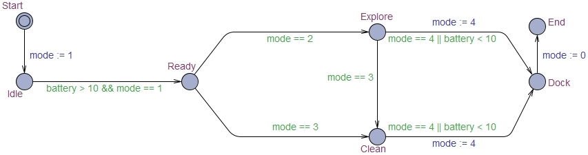
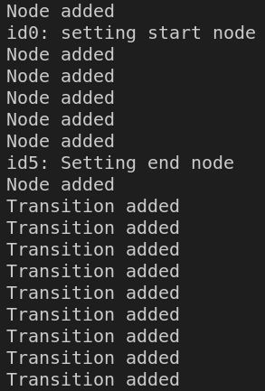
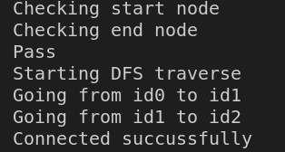

<!-- PROJECT LOGO -->
<br /></br>
<div align="center">
    
</div>
<div align="center">  
  <!-- PROJECT SHIELDS -->
  <p align="center">
    </br>
    
    
    
    
    
  </p>

  <h3 align="center">MODEL TRANSLATOR</h3>
  <div align="center">
     <a href="">
      
    </a>
  </div>
  </br>
  <p align="center">
    Translate XML model into Python code
    <br />
    <a href="https://tcc2021seniorproject.github.io/"><strong>Visit our website for full documentation »</strong></a>
    <br />
    <br />
    <a href="https://docs.google.com/document/d/e/2PACX-1vRTo8ReSNkiQpujZEZgLHO4aHVmF3FWq7vQh247OKN9kj_EMBtQf2SMMnxD8Yfgk-3zjVv4AAqBx-2o/pub">View current process</a>
    ·
    <a href="https://github.com/TCC2021SeniorProject/ModelTranslator/issues">Report Bug</a>
    ·
    <a href="https://github.com/TCC2021SeniorProject/ModelTranslator/issues">Request Feature</a>
  </p>
</div>
</br>
</br>


## TABLE OF CONTENTS
<ol>
  <li>
    <a href="#about-the-project">About The Project</a>
  </li>
  <li>
    <a href="#getting-started">Getting Started</a>
    <ul>
      <li><a href="#prerequisites">Prerequisites</a>
      </li>
    </ul>
  </li>
  <li><a href="#usage">Usage</a></li>
  <li><a href="#roadmap">Roadmap</a></li>
  <li><a href="#testing-schedules">Testing Schedules</a></li>
  <li><a href="#license">License</a></li>
  <li><a href="#contact">Contact</a></li>
</ol>

<!-- ABOUT THE PROJECT -->
## About The Project

This project will assist developers on establishing IoT system.

Here's why you should use this:
* Users who wants to design automata with UPPAAL but has no idea what to do with the generated XML file.
* Users who wants their modeled diagrams runs on RaspPi device.
* Users who wants to test out IoT environment with the modeling tool (UPPAAL).


<p align="right">(<a href="#top">back to top</a>)</p>


### Tools Used With


* [UPPAAL](https://uppaal.org/)
* [Python](https://www.python.org/)
  * [xml.etree.ElementTree](https://docs.python.org/3/library/xml.etree.elementtree.html)
  * [re](https://docs.python.org/3/library/re.html)
* [VS CODE](https://code.visualstudio.com/)

<p align="right">(<a href="#top">back to top</a>)</p>


<!-- GETTING STARTED -->
## Getting Started

This is an example of how you may give instructions on setting up your project locally.
To get a local copy up and running follow these simple example steps.

### Prerequisites

Download UPPAAL to make your own cases
* [DOWNLOAD UPPAAL](https://uppaal.org/)
  

### Demo Installation

1. Clone the repo
   ```sh
   git clone https://github.com/TCC2021SeniorProject/ModelTranslator.git
   ```
2. Download XML examples
   ```sh
   
   ```
3. Run Main.py program
   ```sh
    cd ./MdoelTranslator/src
   
   ```

### Result of running XML_parser.py

0. When producing a model such like this in UPPAAL
  <div align="center">
      
  </div>


1. Suppose there is a XML file given like this

```xml
  <?xml version="1.0" encoding="utf-8"?>
  <!DOCTYPE nta PUBLIC '-//Uppaal Team//DTD Flat System 1.1//EN' 'http://www.it.uu.se/research/group/darts/uppaal/flat-1_2.dtd'>
  <nta>
    <declaration>// Global declarations. 
  int status1, charge1;</declaration>
    <template>
      <name x="9" y="9">Simple</name>
      <parameter>int &amp;mode,  int &amp;battery</parameter>
      <declaration>// Place local declarations here.
  </declaration>
      <location id="id0" x="-391" y="-323">
        <name x="-408" y="-357">End</name>
      </location>
      <location id="id1" x="-603" y="-323">
        <name x="-629" y="-357">Clean</name>
      </location>
      <location id="id2" x="-731" y="-323">
        <name x="-756" y="-357">Ready</name>
      </location>
      <location id="id3" x="-952" y="-323">
        <name x="-960" y="-357">Start</name>
      </location>
      <transition>
        <source ref="id1"/>
        <target ref="id0"/>
        <label kind="guard" x="-578" y="-340">mode == 4 || battery &lt; 10</label>
        <label kind="assignment" x="-535" y="-323">mode := 4</label>
      </transition>
      <transition>
        <source ref="id2"/>
        <target ref="id1"/>
        <label kind="guard" x="-705" y="-340">mode == 3</label>
      </transition>
      <transition>
        <source ref="id3"/>
        <target ref="id2"/>
        <label kind="guard" x="-926" y="-340">mode == 1 &amp;&amp; battery &gt; 10</label>
      </transition>
    </template>
    <system>// Place template instantiations here.
  r1 = Simple(status1, charge1);

  // List one or more processes to be composed into a system.
  system r1;</system>
    <queries>
      <query>
        <formula></formula>
        <comment></comment>
      </query>
    </queries>
  </nta>
```

2. After running XML_parser, this will parse crutial data to graph objects. Below image is output lines as a result of conversion

</br>
<div align="left">
    
</div>
</br>
</br>

3. Then the parser automatically checks all the required data such as a starting state, an end state, infinity, and connectionless transitions.

</br>
<div align="left">
    
</div>
</br>
</br>

<p align="right">(<a href="#top">back to top</a>)</p>

4. Finally, our program generates a python script file looking like below:

```python
class TestClass:

	def __init__(self, ):
		print('Running constructor')
		self.status1 = 0
		self.charge1 = 0
		self.status2 = 0
		self.charge2 = 0
		self.status3 = 0
		self.charge3 = 0

	async def End(self):
		exit()

	async def Dock(self):
		await self.Ready()
		await self.End()

	async def Explore(self):
		if self.mode == 4 or self.battery < 10 :
			self.mode = 4
			await self.Dock()
		if self.mode == 3 :
			await self.Clean()


	async def Clean(self):
		if self.mode == 4 or self.battery < 10 :
			self.mode = 4
			await self.Dock()


	async def Ready(self):
		if self.mode == 3 :
			await self.Clean()
		if self.mode == 2 :
			await self.Explore()


	async def Idle(self):
		if self.battery > 10 and self.mode == 1 :
			await self.Ready()


	async def Start(self):
		self.mode = 1
		await self.Idle()


TestClass.Start()
```

<!-- USAGE EXAMPLES -->
## Usage


_For more examples, please refer to the [Design Documentation](https://docs.google.com/document/d/e/2PACX-1vQ0GhSxaPt2g3zVoJ4P_tEIz-wvtw0bt5sdaG9b234H0Y10dJu01ctV5YPrfZKCXZp57UvUPH7nJ3qQ/pub)_

<p align="right">(<a href="#top">back to top</a>)</p>


<!-- ROADMAP -->
## Roadmap

_For more plans, please see the [plan documentation](https://drive.google.com/file/d/1UHxCx8l3Wgu_6PQxfjx6K0d7gkP5ybov/view)_

### Task 1 check list - Due October 16.
- [x] Update mark down documentation.
- [x] Create mock Python code output.
- [x] Make UPPAAL parser.
- [x] Program is able to traverse all the nodes through tranistion objects.
- [x] Program is able to identify the validity of the model.
- [x] Program is able to validate the node function (e.g. starting node, termination node, logic node, process node, etc)
- [x] Make Python code generator/converter.
- [x] Test simple diagram.


### Task 2 check list - Due October 23.
- [x] Make complex diagram 1
- [ ] Update (enhance) UPPAAL parser
- [ ] Update (enhance) Python code generator/converter
- [ ] Test complex diagram 1

### Task 3 check list - Due October 23.
- [x] Make complex diagram 2
- [ ] Update (enhance) UPPAAL parser
- [ ] Update (enhance) Python code generator/converter
- [ ] Test complex diagram 2

See the [open issues](https://github.com/TCC2021SeniorProject/ModelTranslator/issues) for a full list of proposed features (and known issues).

</br>

## Testing Schedules

</br>

| Case        | Testing Responder   | Due Date |
| ----------- | ------------------- | -------- |
| Test case 1 | Tony, Cameron, Cael | Oct 9    |
| Test case 2 | Tony, Cameron       | Oct 17   |
| Test case 3 | Tony, Cameron       | Oct 23   |
| Test case 4 | Tony, Cameron, Cael | Nov 21   |
| Test case 5 | Cael                | Oct 10   |
| Test case 6 | Cael                | Oct 24   |
| Test case 7 | Tony, Cael          | Dec 12   |
| Test case 8 | Tony, Cameron, Cael | Dec 12   |

</br>

To view the specific testing details, **[click here](https://docs.google.com/document/d/e/2PACX-1vQC5scu0DfEu0nLqPVWZzML1m6oMh8Q2Oo86GEyt_GFx_NB7BA3BZWF44hMv6tEFyhgTrATsf8TUQL3/pub)**

*MCCD* refers to Main Control Center Device.

- [x] Test case 1 (Due Oct  9): Produce code from a simple model
- [x] Test case 2 (Due Oct 17): Model comparatively massive size diagram
- [x] Test case 3 (Due Oct 23): Build infinite loops / Redundant transitions.
- [ ] Test case 4 (Due Nov 21): Change models to python codes that MCCD accepts.
- [ ] Test case 5 (Due Oct 10): Simple signalling to the device
- [ ] Test case 6 (Due Oct 24): Complex signalling to the device
- [ ] Test case 7 (Due Dec 12): Handling devices via web application on MCCD
- [ ] Test case 8 (Due Dec 12): MCCD can be postponed until the device finishes its current job


<p align="right">(<a href="#top">back to top</a>)</p>


## Coding Style Convention

**See the following link: [Style Guide for Python Code](https://www.python.org/dev/peps/pep-0008/)**

**Follow rules for better readability: [Clean Code by Robert C. Martin](https://gist.github.com/wojteklu/73c6914cc446146b8b533c0988cf8d29)**
</br>


<!-- LICENSE -->
## License

Currently there is no license for this repo meaning our team retain all rights to the source code and no one may reproduce, distribute, or create derivative works from our work.

This will not be permanent until the completion of the project.

<p align="right">(<a href="#top">back to top</a>)</p>


<!-- CONTACT -->
## Contact

#### Director
>  Dr. Siddhartha Bhattacharyya </br>
email:[sbhattacharyya@fit.edu](sbhattacharyya@fit.edu)

#### Developers
> Sung-Jun Baek </br>
email:[roni2006@hanmail.net](roni2006@hanmail.net) </br>
GitHub Link: [https://github.com/MarcoBackman](https://github.com/MarcoBackman)

> Caelan Shoop </br>
email:[cshoop2018@my.fit.edu](cshoop2018@my.fit.edu)

> Cameron Wright </br>
email:[cameron2018@my.fit.edu](cameron2018@my.fit.edu)


<p align="right">(<a href="#top">back to top</a>)</p>
